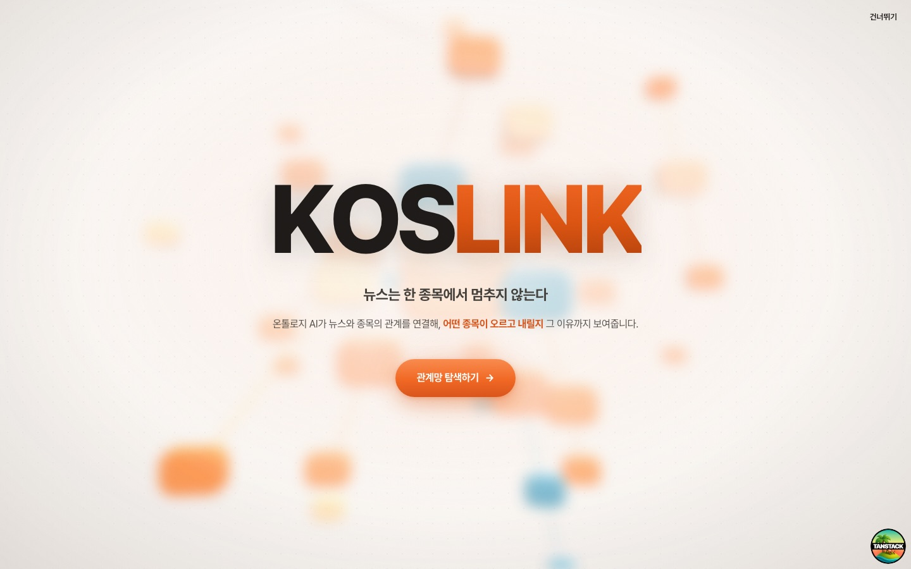
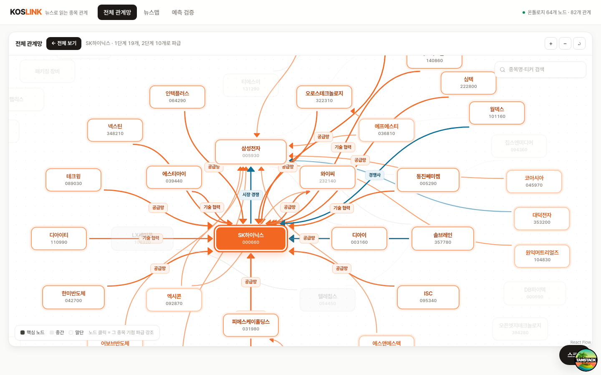
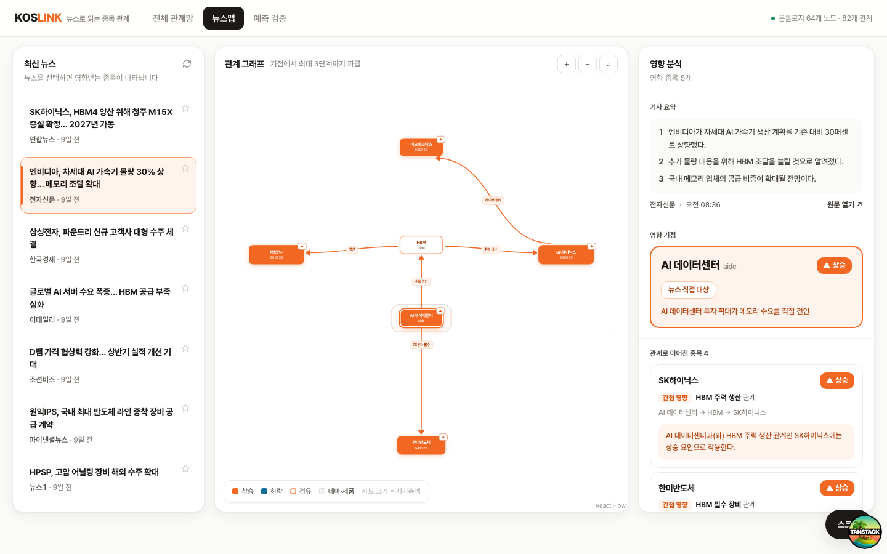
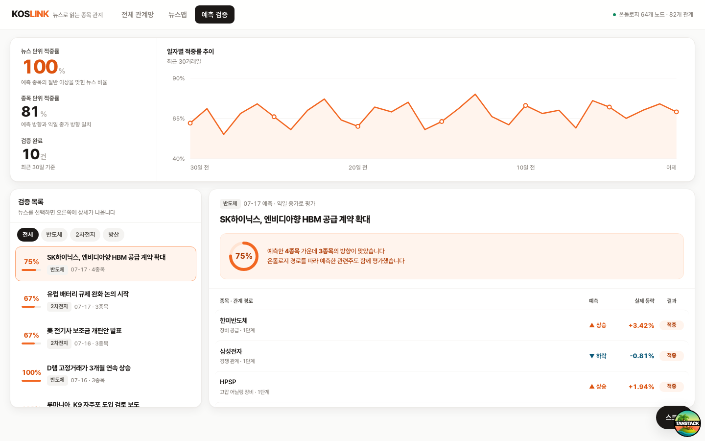
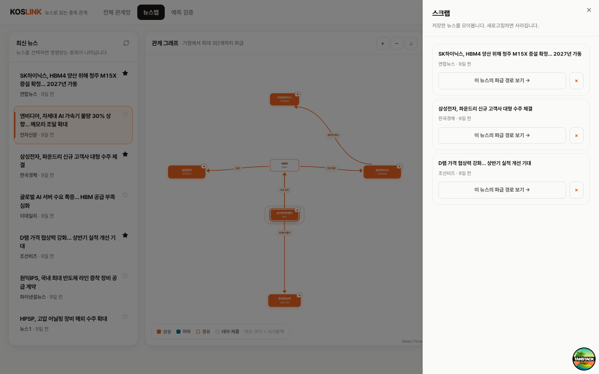

<div align="center">



# KOS<span style="color:#F26722">LINK</span>

**뉴스 한 건이 어떤 종목까지 이어지는지, 온톨로지 그래프로 보여주는 서비스**

</div>

<br/>

## 1. 서비스 소개

뉴스를 클릭하면 **공급망 · 경쟁 · 소재 흐름** 관계를 따라 영향받는 종목과 그 이유를 그래프로 즉시 보여줍니다.

단순히 기사에 등장한 종목명을 매칭하는 것이 아니라, 온톨로지 상의 관계를 **2단계(hop) 이상** 추적합니다. 그래서 뉴스에 이름이 언급되지 않은 종목도 "왜" 영향을 받는지 그 경로(공급망 → 경쟁사 → 소재 조달 등)까지 함께 드러납니다.

- 신뢰도 퍼센트 대신 **직접/간접/확산(hop 수)** 으로만 영향도를 표현합니다.
- 같은 뉴스에서도 **상승 종목과 하락 종목을 함께** 제시합니다.
- 과거 예측이 실제로 맞았는지 **검증 화면**에서 되짚어볼 수 있습니다.

> 기획 배경: [`docs/KOSLINK-PROPOSAL.md`](./docs/KOSLINK-PROPOSAL.md) · API 명세: [`docs/API_EXAMPLE.md`](./docs/API_EXAMPLE.md)

<br/>

## 2. 기술 스택

| 영역 | 선택 |
|---|---|
| Framework | React 19 + Vite (CSR) |
| Routing | TanStack Router (파일 기반) |
| Data Fetching | TanStack Query |
| Styling | Tailwind CSS v4 + shadcn/ui (new-york style) |
| HTTP Client | ky |
| UI 상태 | Jotai |
| Graph | @xyflow/react (React Flow v12) |
| 3D | three.js (커버 인트로) |
| Mocking | MSW (백엔드 없이 개발) |
| Test | Vitest + Testing Library |
| Lint / Format | ESLint + Prettier |

```bash
pnpm install
pnpm dev             # http://localhost:3000
```

| 명령어 | 설명 |
|---|---|
| `pnpm dev` | 개발 서버 실행 (포트 3000) |
| `pnpm build` | 프로덕션 빌드 |
| `pnpm test` | 테스트 실행 (Vitest) |
| `pnpm lint` | ESLint 검사 |
| `pnpm format` | Prettier + ESLint 자동 수정 |
| `pnpm check` | Prettier 검사만 |
| `pnpm generate-routes` | 라우트 트리 생성 |

<br/>

## 3. 폴더 구조

**카테고리 우선, 그 아래 도메인** 순서로 정리되어 있습니다. `components`, `hooks`, `utils`, `constants`, `types`, `apis`, `store`, `mocks` 각각이 최상위 폴더를 갖고, 그 안에서 다시 도메인(`news`, `graph`, `analysis`, `verify`, `scrap`, `cover`)별로 나뉩니다. 2개 이상 도메인이 함께 쓰는 코드만 `shared/`에 모읍니다.

```
src/
├── routes/                       # 파일 기반 라우트 (__root, index, app)
├── shared/                       # 2개 이상 도메인이 공유하는 코드
│   ├── components/                 #   Header(GNB)
│   ├── hooks/                      #   useInfiniteScrollTrigger
│   ├── utils/                      #   cn, format, graphIndex(bfsBuild)
│   ├── constants/                  #   tabs
│   ├── types/                      #   Direction
│   ├── apis/                       #   http, paginate
│   ├── store/                      #   viewAtom, selectedNewsIdAtom, ...
│   └── mocks/                      #   handlers 통합, MSW worker
├── components/
│   ├── cover/                      # 3D 인트로 (CoverScreen)
│   ├── news/                       # 뉴스 리스트 / 카드 / 모바일 바
│   ├── graph/                      # React Flow 그래프 (GraphPanel, NetworkView)
│   ├── analysis/                   # 영향 분석 패널
│   ├── verify/                     # 예측 검증
│   ├── scrap/                      # 관심 뉴스 스크랩 시트
│   └── ui/                         # shadcn 컴포넌트 (flat 유지)
├── hooks/graph/                  # usePropagation (하이라이트 리빌 시퀀스)
├── utils/graph/                  # layout.ts (radial / full 레이아웃)
├── constants/{graph,verify}/
├── types/{news,graph,analysis,verify}/
├── apis/{news,graph,analysis,verify}/   # mock.ts + queries.ts (+ mappers.ts)
├── store/{news,graph,verify,scrap}/     # Jotai atoms, 도메인별 1파일
├── mocks/{news,graph,analysis,verify}/  # MSW 핸들러 + mock 데이터
├── integrations/tanstack-query/
└── main.tsx, router.tsx, styles.css
```

`#/*`, `@/*` 모두 `./src/*`로 매핑됩니다.

```ts
import { cn } from '#/shared/utils/cn'
import { cn } from '@/shared/utils/cn'
```

<br/>

## 4. 서비스 페이지 & 핵심 기능

### 커버 (`/`)


three.js로 구현한 인트로. 중심 종목에서 관계가 계층적으로 뻗어나가는 모습을 보여준 뒤 `/app`으로 진입합니다. "건너뛰기"로 스킵할 수 있습니다.

### 전체 관계망 (`/app` · 전체 관계망 탭)



온톨로지 그래프 전체(64개 노드 · 82개 관계)를 한 화면에 펼쳐 보여줍니다. 노드를 클릭하면 그 종목을 기점으로 연결된 관계가 제자리에서 하이라이트됩니다. 앱 최초 진입 시 허브 노드가 자동으로 한 번 하이라이트됩니다.

### 뉴스맵 (`/app` · 뉴스맵 탭, 기본 화면)



가장 핵심적인 화면입니다. 왼쪽에서 뉴스를 고르면, 가운데 그래프에 그 뉴스의 **파급 경로**(기점 → 1단계 → 2단계 → 3단계)가 hop 순서대로 순차 애니메이션되며 그려지고, 오른쪽 패널에 기사 3줄 요약과 영향받는 종목별 근거가 나타납니다.

### 예측 검증 (`/app` · 예측 검증 탭)



과거 뉴스 기반 예측이 실제 종가 방향과 맞았는지 보여줍니다. 뉴스 단위/종목 단위 적중률, 최근 30거래일 추이 그래프, 뉴스별 예측-실제 비교 표로 구성됩니다. 관심 종목 브리핑에서 넘어오면 해당 종목이 등장한 검증 건만 필터링됩니다.

### 스크랩



뉴스 카드의 ☆ 아이콘으로 관심 뉴스를 모아두는 세션 메모리 기능입니다. 우하단 FAB로 열 수 있으며, 저장한 뉴스에서 바로 그 뉴스의 파급 경로로 이동할 수 있습니다. 새로고침하면 초기화됩니다(localStorage 미사용).

<br/>

## 5. 기술적 핵심 / 최적화

**레이아웃 라이브러리 없이 삼각함수로 그래프 배치**
React Flow는 레이아웃 엔진을 제공하지 않습니다. dagre·elkjs 등을 붙이는 대신 `utils/graph/layout.ts`에서 직접 좌표를 계산합니다 — 파급 경로는 기점을 중심에 두고 hop 레벨별 동심원(`radialLayout`), 전체 관계망은 섹터별 중심에 연결 수 내림차순 3단 동심원(`fullLayout`)으로 배치합니다. `fullLayout` 결과는 `useMemo`로 캐시해, 탭을 오갈 때 노드가 다시 계산되어 튀는 현상을 막습니다.

**Handle에 스냅되지 않는 커스텀 플로팅 엣지**
기본 React Flow 엣지는 카드의 Handle 위치에 고정돼 방사형 배치에서 옆구리에 어긋나 붙습니다. `RelEdge.tsx`가 두 카드(사각형)의 테두리 교점을 직접 계산해 방향에 맞는 지점끼리 이어줍니다.

**리마운트에도 끊기지 않는 1회성 드로잉 애니메이션**
React Flow의 `animated: true`는 쓰지 않습니다. 엣지가 그려지는 연출은 CSS `stroke-dashoffset` 트랜지션 1회 재생으로 처리하는데, 연결된 노드가 갱신되며 엣지가 리마운트되는 경우를 대비해 클래스 토글이 아니라 **"그리기 시작 시각(`drawAt`) 기준 경과 시간"** 으로 시작 오프셋을 계산합니다. 리마운트되어도 애니메이션이 처음부터 다시 재생(깜빡임)되지 않습니다.

**뉴스 파급 / 노드 탐색 / 전체 관계망 하이라이트가 공유하는 리빌 시퀀스 훅**
`usePropagation`(`hooks/graph/usePropagation.ts`) 하나가 "기점 노드 점등 → hop별로 엣지가 순차적으로 그려지고 도착 노드가 확정" 되는 동일한 시퀀스를 timer 기반으로 관리합니다. 최종 색상 규칙(상승/하락/경유)은 씬을 만드는 GraphPanel이 결정하고, 이 훅은 시간차 노출만 담당해 세 화면(뉴스맵, 그래프 검색, 전체 관계망)이 로직을 중복 구현하지 않습니다.

**`nodeTypes`/`edgeTypes`는 항상 모듈 스코프에 선언**
컴포넌트 내부에 선언하면 매 렌더마다 새 참조가 생겨 React Flow가 그래프 전체를 리마운트합니다. `GraphPanel.tsx` 상단에 한 번만 선언해 뷰 전환·상태 변경 시에도 그래프가 유지됩니다.

**TanStack Query 캐시 공유로 중복 요청 제거**
`app.tsx`와 `NewsPanel`이 같은 쿼리 키(`['news']`)를 사용해, 최초 진입 시 "첫 뉴스 자동 선택" 로직과 리스트 렌더링이 같은 캐시를 보고도 API를 두 번 부르지 않습니다. 단, `placeholderData`(mock 첫 항목)로 자동 선택이 확정되지 않도록 실제 응답이 도착한 뒤(`isPlaceholderData === false`)에만 선택 id를 설정합니다.

**커서 기반 무한 스크롤 훅 공유**
뉴스 리스트와 검증 화면 모두 숫자 페이지네이션(1, 2, 3…) 대신 `useInfiniteScrollTrigger` 하나를 공유합니다. `IntersectionObserver`의 `root`를 실제 스크롤 컨테이너로 명시해, 리스트가 페이지 하단에 위치해도 sentinel이 뷰포트 밖에 남아 트리거되지 않는 문제를 피합니다.

**레거시 three.js 색 파이프라인 복원**
커버 인트로 원본(`docs/koslink-cover-3d.html`)은 색 관리가 없던 three.js r128 기준으로 만들어졌습니다. 최신 three는 sRGB↔linear 변환과 물리 기반 광량 스케일을 기본으로 켜기 때문에, 같은 hex/광량 값을 그대로 쓰면 채도가 빠지고 어두워 보입니다. `ColorManagement`를 끄고 출력 컬러스페이스를 `LinearSRGBColorSpace`로, 조명 세기에는 π를 곱해 원본과 동일한 색감을 복원했습니다.

<br/>

## 디자인 제약

- 주황(`#F26722`)은 그래프 영향 표시 전용 — 버튼/탭/GNB 등 장식용 사용 금지
- 신뢰도 퍼센트 미표시 — 영향도는 직접/간접/확산(hop 수)으로만 표현
- 기사 본문 대신 3줄 요약 + 원문 링크만 제공(저작권)
- 로그인/회원가입/설정 화면 없음, localStorage 미사용
- 뉴스 리스트/검증 화면 모두 숫자 페이지네이션 없이 커서 기반 무한 스크롤
